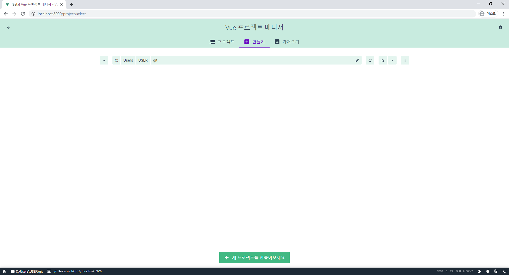
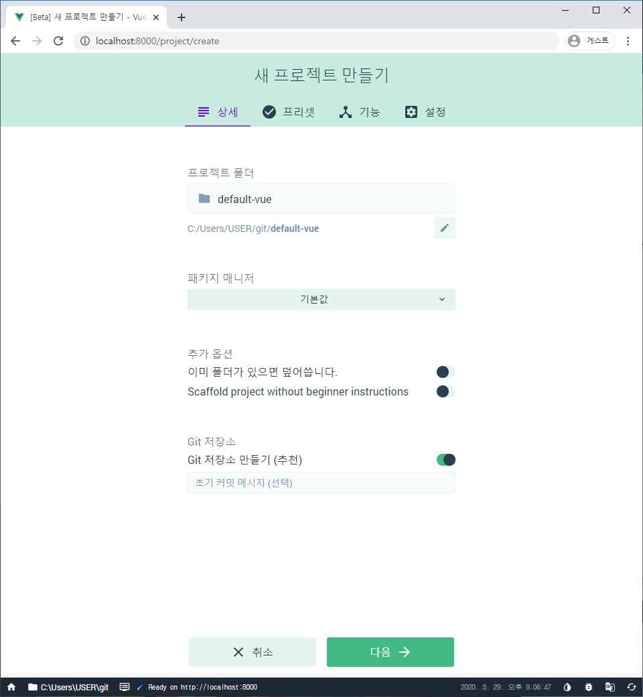
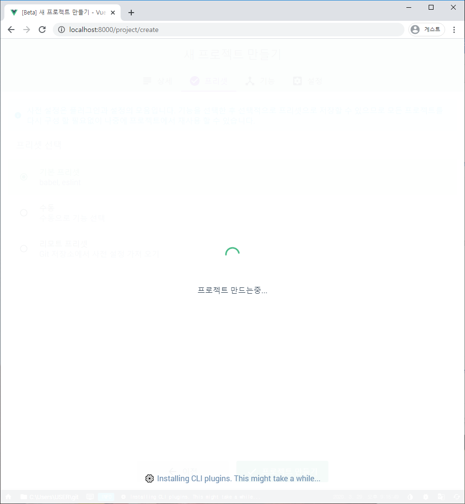
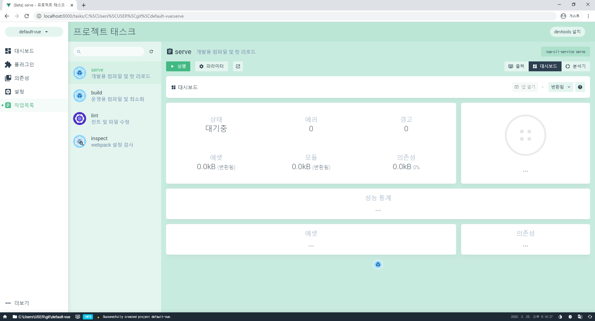
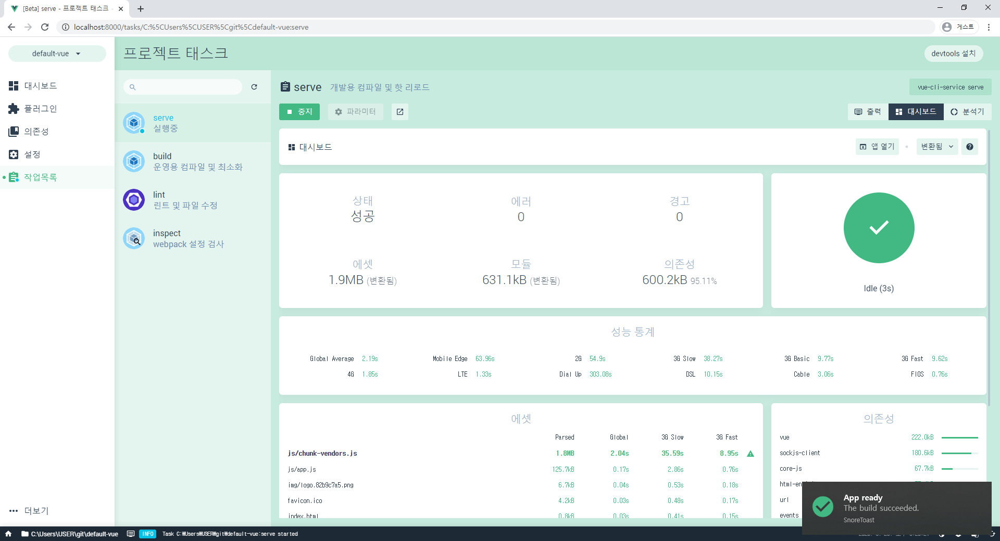
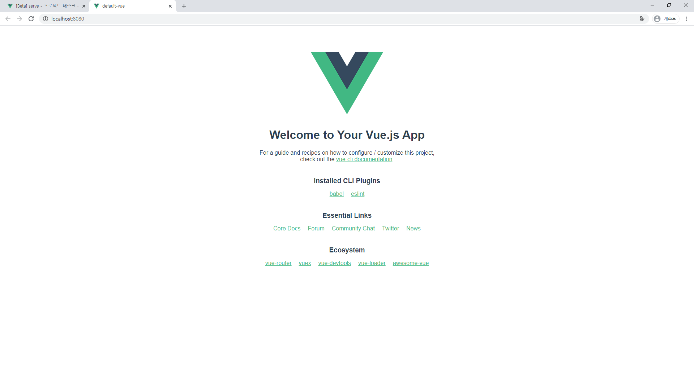

Vue.js 공부를 하면서 프로젝트를 시작하는 과정을 기록합니다.

처음 공부하는 거라 틀린 부분이 있을 수 있습니다.

0. 사전 준비
   - Node.js(8.11.0 이상 버전) 설치

1. Vue.js 설치(https://vuejs.org/v2/guide/installation.html)

   ~~~shell
   $ npm install vue
   ~~~

   

2. Vue Router 설치(https://router.vuejs.org/installation.html)

   ~~~shell
   $ npm install vue-router
   ~~~

   

3. Vue CLI 설치(https://cli.vuejs.org/guide/installation.html)

   ~~~shell
   $ npm install -g @vue/cli
   ~~~

   

4. Vue CLI 실행

   ~~~shell
   $ vue ui
   🚀  Starting GUI...
   🌠  Ready on http://localhost:8000
   ~~~

   1~3 설치를 완료한 후 명령어를 입력하면 GUI 환경의  Vue 프로젝트 매니저가 실행됩니다.

   

5.  프로젝트 생성

   

   하단 중앙에 있는 [+ 새 프로젝트를 만들어보세요] 버튼을 클릭합니다.

   

   

   생성할 프로젝트의 경로와 이름을 정해서 작성합니다.

   

   

   프리셋 탭에서 기본 프리셋을 선택하고 [프로젝트 만들기] 버튼을 클릭합니다.

   

   

   프로젝트가 생성되는 데 1분정도 필요합니다.

   

   

   프로젝트 생성이 완료되면 프로젝트 대시보드가 나타납니다.

   

   

   - 왼쪽 메뉴에서 [작업목록] 클릭 - 프로젝트 태스크로 이동됨

   - [serve(개발용 컴파일 및 핫 리로드)] 클릭
   - [실행] 클릭

   

   실행이 완료되면 우측의 [앱 열기] 버튼을 클릭합니다.

   http://localhost:8080/에서 생성된 프로젝트를 확인해볼 수 있습니다.

   

   

   우측 상단의 [출력] 버튼을 클릭하면 출력 내용과 주소를 확인해볼 수 있습니다.

   

   

   간단하게 Vue.js App이 만들어졌습니다.

   

6. 폴더 구조 확인

   ~~~
   📦default-vue // 프로젝트 root 폴더
    ┣ 📂node_modules
    ┣ 📂public
    ┃ ┣ 📜favicon.ico // 파비콘
    ┃ ┗ 📜index.html // <html lang="en">에서 en을 kr로 바꾸면 페이지 언어가 수정됨
    ┣ 📂src
    ┃ ┣ 📂assets
    ┃ ┣ 📂components
    ┃ ┃ ┗ 📜HelloWorld.vue
    ┃ ┣ 📜App.vue // 가장 상위에서 실행되는 vue 파일
    ┃ ┗ 📜main.js
    ┣ 📜.gitignore
    ┣ 📜babel.config.js
    ┣ 📜package-lock.json
    ┣ 📜package.json
    ┗ 📜README.md
   ~~~

   index.html에서 App.vue 파일을 호출하고, App.vue 파일에서는 HelloWorld.vue 파일을 호출합니다.

   

   ~~~html
   <!-- /public/index.html body 부분 -->
   <body>
       <noscript>
         <strong>We're sorry but <%= htmlWebpackPlugin.options.title %> doesn't work properly without JavaScript enabled. Please enable it to continue.</strong>
       </noscript>
       

 <!-- 이곳에서 App.vue 파일 실행 -->
       <!-- built files will be auto injected -->
   </body>
   ~~~

   

   ~~~vue
   // /src/App.vue
   <template>
     

       
       <HelloWorld msg="Welcome to Your Vue.js App"/> <!-- 이곳에서 HelloWorld.vue 파일 실행 -->
     

   </template>
   
   
   ~~~
   

다음엔 프로젝트에 Vuetify를 추가하는 방법을 포스팅해보려합니다.