Vue.js 공부를 하면서 프로젝트를 시작하는 과정을 기록합니다.

처음 공부하는 거라 틀린 부분이 있을 수 있습니다.

지난 포스팅에서 만들었던 Vuetify가 추가된 Vue 프로젝트에 Firebase의 DB인 Firestore를 연결해서 Todo 앱을 만들어보겠습니다.

### 1. Firebase와 Vuefire 설치

~~~shell
$ npm install firebase vuefire
~~~

   명령어를 입력하면 Vue 프로젝트에 Firebase와 Vuefire가 추가됩니다.

****

### 2. Firebase 프로젝트 생성

#### 2.1 https://console.firebase.google.com 구글 계정 로그인 후 [프로젝트 만들기] 클릭
#### 2.2 프로젝트 이름 작성 후 [계속] 클릭
#### 2.3 Google 애널리틱스 사용 설정 또는 해제 (아무거나 상관 없음) 후 [프로젝트 만들기] 클릭
#### 2.4 잠시 기다린 후 '새 프로젝트가 준비되었습니다.'가 나오면 [계속] 클릭
#### 2.5 프로젝트 생성 완료

****

### 3. Firebase 설정

#### 3-1. 앱에 Firebase를 추가하여 시작하기
   - [</> 아이콘] 클릭
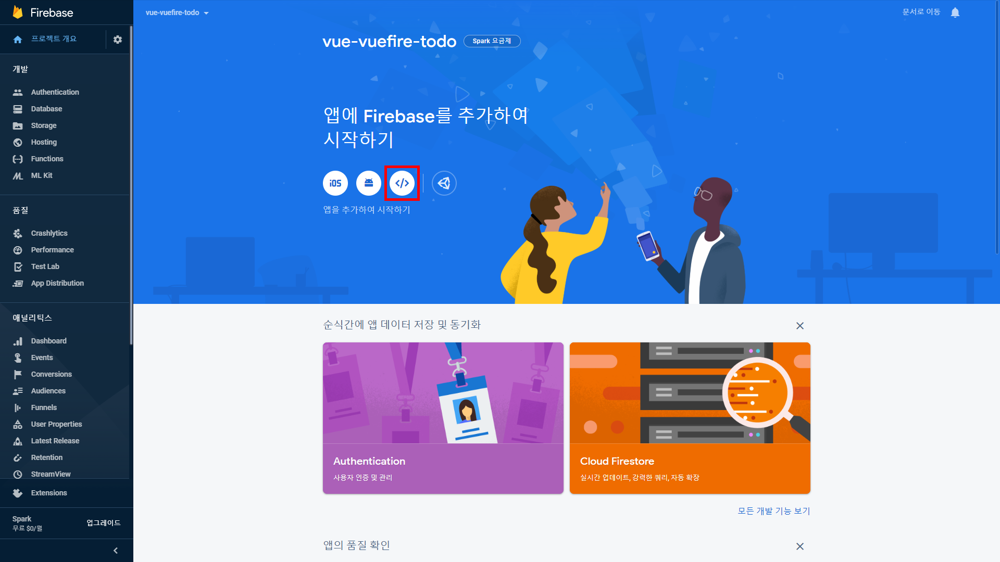
   - 앱 닉네임 작성 후 [앱 등록] 클릭
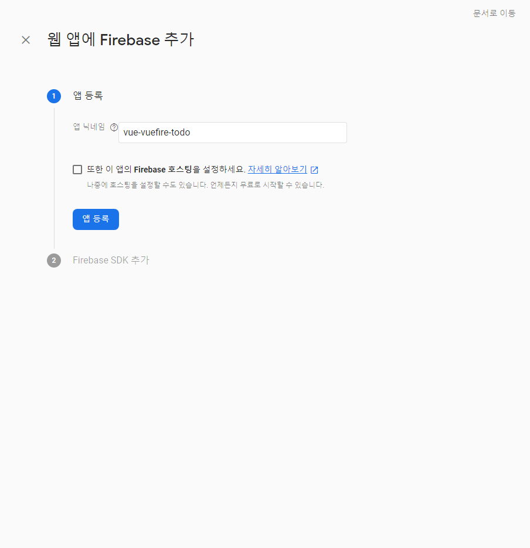
   - firebaseConfig 내용 복사 후 [콘솔로 이동] 클릭
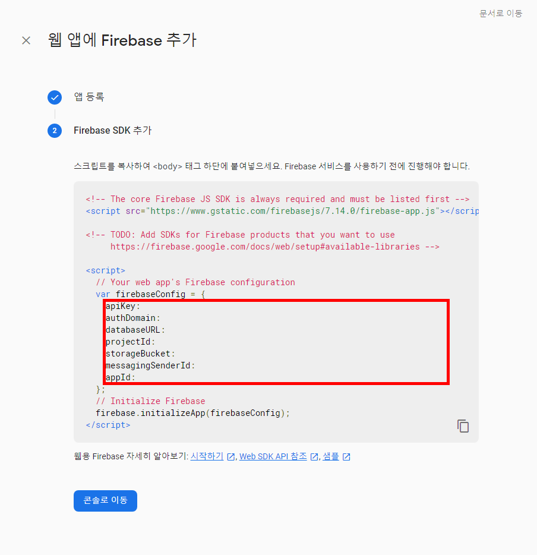

#### 3-2. firebase.js 생성
~~~javascript
// /src/Firebase.js
import { initializeApp } from "firebase";

// 3-1에서 복사한 firebaseConfig를 아래에 붙여넣기
const firebaseConfig = {
 apiKey: "",
 authDomain: "",
 databaseURL: "",
 projectId: "",
 storageBucket: "",
 messagingSenderId: "",
 appId: ""
};

const app = initializeApp(firebaseConfig);

export const db = app.firestore();
export const todosCollection = db.collection('todos');
// db에서 가져올 컬렉션 이름을 'todos'로 설정
~~~

#### 3-3. main.js 수정

~~~javascript
// /src/main.js

import Vue from "vue";
import App from "./App.vue";
import vuetify from "./plugins/vuetify";

import './firebase'
// 3-2에서 생성한 firebase.js 파일을 가져옵니다.
import {firestorePlugin} from "vuefire";
Vue.use(firestorePlugin);
// Firestore를 사용할 것이기 때문에 firestorePlugin를 설정합니다.

Vue.config.productionTip = false;

new Vue({
 vuetify,
 render: h => h(App)
}).$mount("#app");
~~~

****

### 4. Cloud Firestore 데이터베이스 만들기
#### 4-1. 프로젝트 콘솔 메인에서 Cloud Firestore 배너 클릭

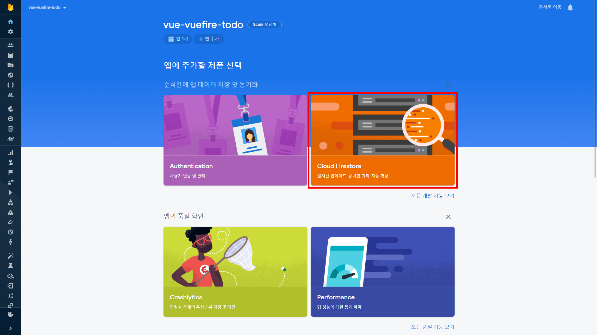

#### 4-2. [데이터베이스 만들기] 클릭
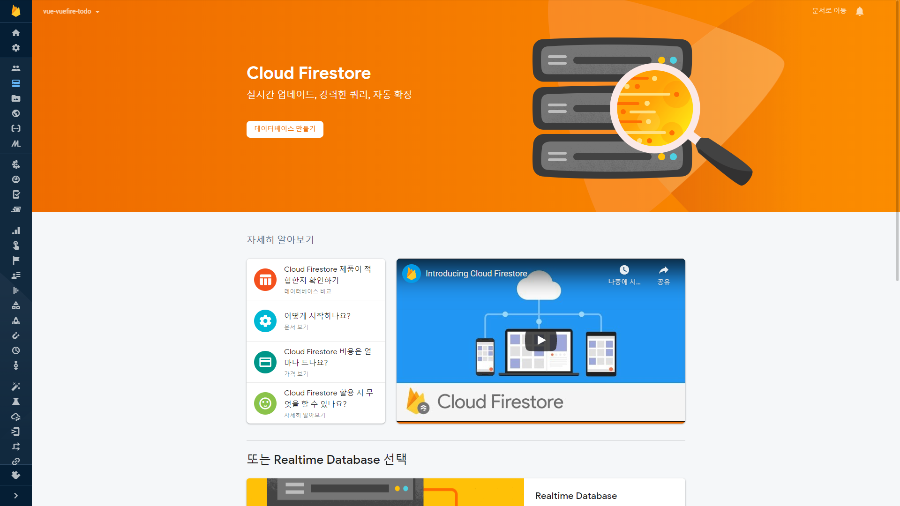

   

#### 4-3. 보안 규칙 설정

   - [테스트 모드로 시작] 클릭 (추후 설정을 변경해줘야 함)
   - [다음] 클릭
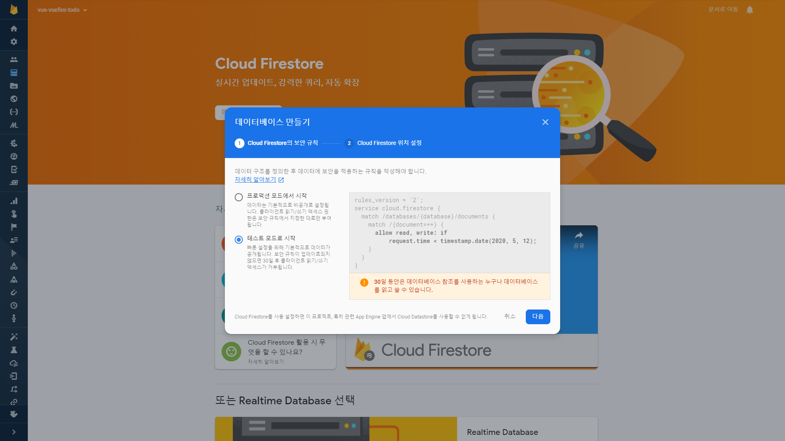

#### 4-4. 위치 설정

   - 데이터베이스가 만들어질 물리적인 위치를 설정합니다.
   - 앱을 주로 사용하는 사용자와 물리적으로 가까운 위치로 설정하는 것이 좋습니다.
   - 한국 사용자 기준 도쿄에 위치한 [asia-northeast1] 선택
   - [완료] 클릭
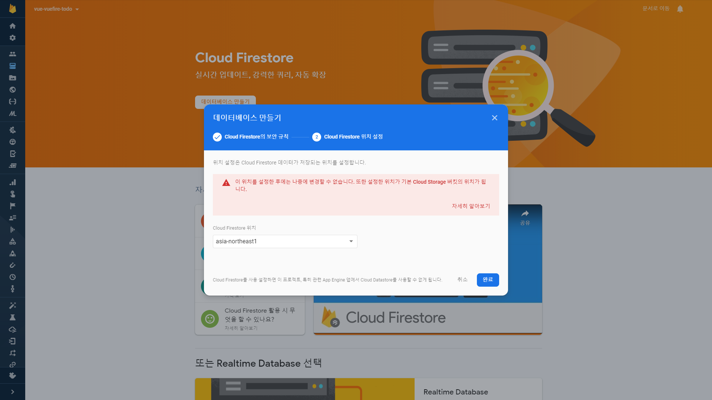
   - (참고)

   
#### 4-5. Database 생성 완료
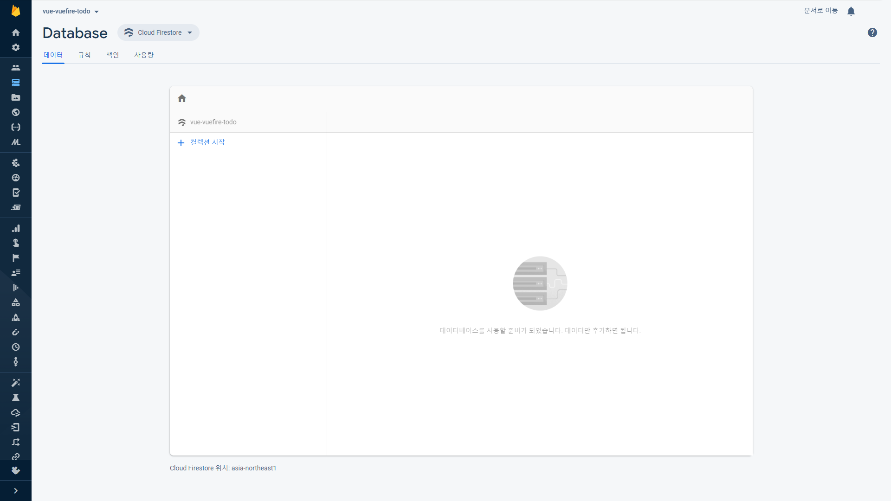

****

### 5. DB에 임시 데이터 삽입
#### 5-1.  컬렉션 ID 지정
   - [+ 컬렉션 시작] 클릭
   - 3-2에서 설정한 'todos'를 컬렉션 ID에 입력
~~~javascript
// /src/Firebase.js
...
export const todosCollection = db.collection('todos');
// db에서 가져올 컬렉션 이름을 'todos'로 설정
...
~~~

   - [다음] 클릭

#### 5-2. 첫 번째 문서 추가
   - 문서 ID는 공란으로 설정 (자동 ID가 생성됨)
   - completed, boolean : Todo 완료 여부 저장
   - createdDate, timestamp: Todo 생성 일시 저장
   - text, string: Todo 내용 저장
   - 입력 후 [저장] 클릭

****

### 6. Vue 설정
#### 6-1. Todo.vue 생성
   - Vuetify Form과 List 문서를 참고해서 기본적인 구조 생성

~~~vue
// /src/components/Todo.vue
<template>
     <v-container>
    <v-card class="mx-auto" max-width="600">
         <v-form ref="form">
        <v-row align="center" justify="center">
             <v-col cols="9">
               <v-text-field v-model="newTodo" label="New Todo"></v-text-field>
               <!-- 새로운 Todo를 입력하는 텍스트 필드 -->
             </v-col>
             <v-col cols="2">
               <v-btn rounded type="submit" @click.prevent="addTodo()">ADD</v-btn>
               <!-- Todo 추가 버튼 -->
             </v-col>
           </v-row>
         </v-form>
   
         <v-divider></v-divider>
   
         <v-list flat>
           <v-list-item-group multiple active-class>
   
             <v-list-item>
               <template>
                 <v-list-item-action>
                   <v-checkbox input-value="true"></v-checkbox>
                 </v-list-item-action>
   
                 <v-list-item-content>
                   <v-list-item-title>Todo item</v-list-item-title>
                 </v-list-item-content>
               </template>
             </v-list-item>
   
           </v-list-item-group>
         </v-list>
       </v-card>
     </v-container>
   </template>
   
   
~~~

#### 6-2. App.vue 수정
~~~vue
// /src/App.vue
<template>
	<v-app>
   <v-content>
		<Todo />
   </v-content>
	</v-app>
  </template>
  
  
~~~

#### 6-3. 실행 결과

### 7. Firestore CRUD
#### 7-1. Read
   - Todo.vue 수정
 ~~~vue
 // /src/components/Todo.vue
 <template>
   <v-container>
	 <v-card class="mx-auto" max-width="600">
	   <v-form ref="form">
		 <v-row align="center" justify="center">
		   <v-col cols="9">
			 <v-text-field v-model="newTodo" label="New Todo"></v-text-field>
			 <!-- 새로운 Todo를 입력하는 텍스트 필드 -->
		   </v-col>
		   <v-col cols="2">
			 <v-btn rounded type="submit">ADD</v-btn>
			 <!-- Todo 추가 버튼 -->
		   </v-col>
		 </v-row>
	   </v-form>
 
	   <v-divider></v-divider>
 
	   <v-list flat>
		 <v-list-item-group multiple active-class>
 
		   <!-- 
		<v-list-item>
			 <template>
			   <v-list-item-action>
				 <v-checkbox input-value="true"></v-checkbox>
			   </v-list-item-action>
 
			   <v-list-item-content>
				 <v-list-item-title>Todo item</v-list-item-title>
			   </v-list-item-content>
			 </template>
		   </v-list-item>
		-->
		   <!-- 6-1에서 작성했던 부분을 아래와 같이 수정 -->
 
		   <v-list-item v-for="todo in todos" :key="todo.id">
		   <!-- todos로 읽어온 데이터를 반복해서 출력 -->
			 <template>
			   <v-list-item-action>
				 <v-checkbox :input-value="todo.completed"></v-checkbox>
				 <!-- completed에 저장된 완료 여부를 체크박스에 반영 -->
			   </v-list-item-action>
 
			   <v-list-item-content>
				 <v-list-item-title>{{todo.text}}</v-list-item-title>
				 <!-- todo.text 출력 -->
			   </v-list-item-content>
			 </template>
		   </v-list-item>
 
		 </v-list-item-group>
	   </v-list>
	 </v-card>
   </v-container>
 </template>
 
 
 ~~~
   - 실행 결과
     completed의 false 값과 text의 "Test Todo" 값을 불러온 모습
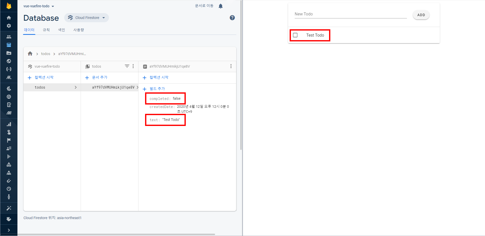

#### 7-2. Create
   - Todo.vue 수정
 ~~~vue
 // /src/components/Todo.vue
 <template>
   <v-container>
	 <v-card class="mx-auto" max-width="600">
	   <v-form ref="form">
		 <v-row align="center" justify="center">
		   <v-col cols="9">
			 <v-text-field v-model="newTodo" label="New Todo"></v-text-field>
		   </v-col>
		   <v-col cols="2">
			 <v-btn rounded type="submit" @click.prevent="addTodo()">ADD</v-btn>
			 <!-- ADD 버튼 클릭시 addTodo 실행 -->
		   </v-col>
		 </v-row>
	   </v-form>
 
	   <v-divider></v-divider>
 
	   <v-list flat>
		 <v-list-item-group multiple active-class>
		   <v-list-item v-for="todo in todos" :key="todo.id">
			 <template>
			   <v-list-item-action>
				 <v-checkbox :input-value="todo.completed"></v-checkbox>
			   </v-list-item-action>
 
			   <v-list-item-content>
				 <v-list-item-title>{{todo.text}}</v-list-item-title>
			   </v-list-item-content>
			 </template>
		   </v-list-item>
		 </v-list-item-group>
	   </v-list>
	 </v-card>
   </v-container>
 </template>
 
	 
 ~~~

   - 실행 결과
     New Todo를 작성하고 ADD 버튼을 클릭하면 실시간으로 DB에 추가되고 콘솔에 문서 ID가 출력되는 것 확인
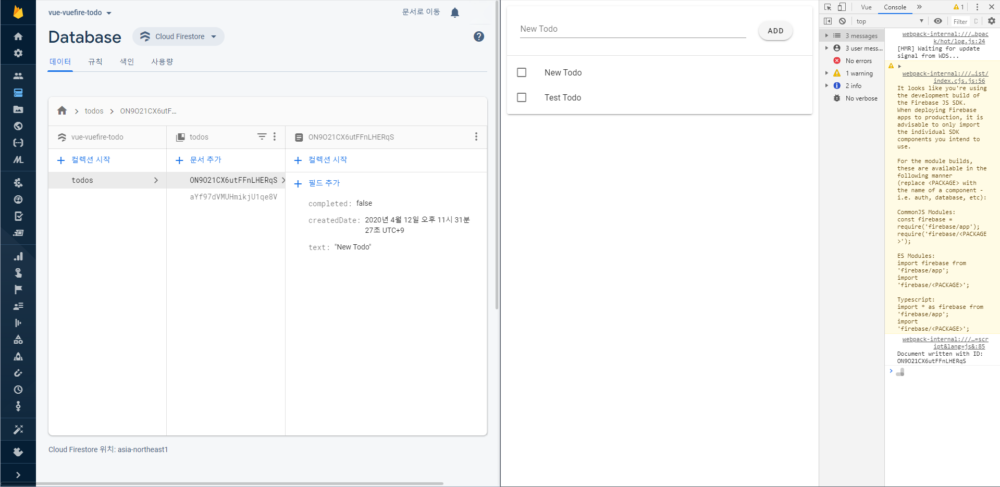

#### 7-3. Update
   - Todo.vue 수정
 ~~~vue
 // /src/components/Todo.vue
 <template>
   <v-container>
	 <v-card class="mx-auto" max-width="600">
	   <v-form ref="form">
		 <v-row align="center" justify="center">
		   <v-col cols="9">
			 <v-text-field v-model="newTodo" label="New Todo"></v-text-field>
		   </v-col>
		   <v-col cols="2">
			 <v-btn rounded type="submit" @click.prevent="addTodo()">ADD</v-btn>
		   </v-col>
		 </v-row>
	   </v-form>
 
	   <v-divider></v-divider>
 
	   <v-list flat>
		 <v-list-item-group multiple active-class>
		   
		   <v-list-item v-for="todo in todos" :key="todo.id">
			 <template>
			   <v-list-item-action>
				 <v-checkbox
				   :input-value="todo.completed"
				   v-model="todo.completed"
				   @change="updateTodo(todo)"
				 ></v-checkbox>
				 <!-- 체크박스 체크가 변경되면 update 실행 -->
			   </v-list-item-action>
 
			   <v-list-item-content>
				 <v-list-item-title>{{todo.text}}</v-list-item-title>
			   </v-list-item-content>
			 </template>
		   </v-list-item>
 
		 </v-list-item-group>
	   </v-list>
	 </v-card>
   </v-container>
 </template>
 
 
 ~~~

   - 실행 결과
     체크박스 클릭시 실시간으로 DB 값이 변경되는 것 확인

#### 7-4. Delete
   - Todo.vue 수정
 ~~~vue
 // /src/components/Todo.vue
 <template>
   <v-container>
	 <v-card class="mx-auto" max-width="600">
	   <v-form ref="form">
		 <v-row align="center" justify="center">
		   <v-col cols="9">
			 <v-text-field v-model="newTodo" label="New Todo"></v-text-field>
		   </v-col>
		   <v-col cols="2">
			 <v-btn rounded type="submit" @click.prevent="addTodo()">ADD</v-btn>
		   </v-col>
		 </v-row>
	   </v-form>
 
	   <v-divider></v-divider>
 
	   <v-list flat>
		 <v-list-item-group multiple active-class>
		   
		   <v-list-item v-for="todo in todos" :key="todo.id">
			 <template>
			   <v-list-item-action>
				 <v-checkbox
				   :input-value="todo.completed"
				   v-model="todo.completed"
				   @change="updateTodo(todo)"
				 ></v-checkbox>
			   </v-list-item-action>
 
			   <v-list-item-content>
				 <v-list-item-title>{{todo.text}}</v-list-item-title>
			   </v-list-item-content>
				 
			   <!-- delete 버튼 -->
			   <v-btn color="red" fab text small @click="deleteTodo(todo)">
				 <v-icon>mdi-delete</v-icon>
			   </v-btn>
			   <!-- 삭제 버튼을 클릭하면 delete 실행 -->
				 
			 </template>
		   </v-list-item>
		 </v-list-item-group>
	   </v-list>
	 </v-card>
   </v-container>
 </template>
 
 
 ~~~

   - 실행 결과
     삭제 버튼 클릭시 실시간으로 DB에서 삭제되는 것 확인
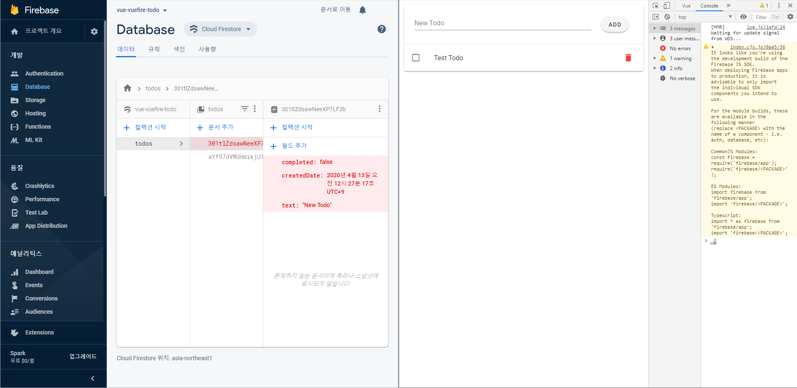

****

간단하게 Firestore DB에 접속해서 CRUD 작업을 해봤습니다.

다음에는 Firebase Authentication으로 회원가입, 로그인을 구현해보겠습니다.

